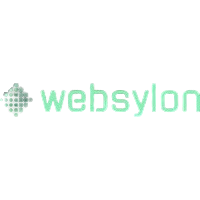

# 🧘 Thai Massage – Website

A modern, elegant website for a Thai massage salon. Bilingual (DE/EN), fully responsive, and optimized for performance & SEO.

> **Status:** Demo phase – go-live pending domain registration


---

## ✨ Features

- 🌐 **Bilingual DE/EN** – one-click language switch, persisted via `localStorage`
- 📱 **Mobile-First Responsive Design** – optimized for all devices (mobile, tablet, desktop)
- 🎨 **Elegant Design System** – custom CSS variables, 3 Google Fonts, consistent color palette
- 🖼️ **Gallery with Lightbox** – masonry grid, keyboard controls, prev/next navigation
- ⚡ **Performance-optimized** – lazy loading, compressed images, lean vanilla JS
- 📧 **Contact Form** – PHP backend (Formspree as fallback)
- 🔍 **SEO-ready** – meta descriptions, Open Graph tags, semantic HTML
- ♿ **Accessible** – ARIA labels, keyboard navigation, dynamic `lang` attribute
- 🍪 **GDPR-compliant** – cookie banner (language preference only, no tracking)
- 🎬 **Scroll Animations** – IntersectionObserver-based reveal effects

---

## 🗂️ Project Structure

```
thai-massage/
├── css/
│   ├── variables.css          # Design tokens (colors, fonts, spacing)
│   ├── base.css               # Reset & base styles
│   ├── navbar.css             # Navigation (desktop + mobile)
│   ├── hero.css               # Hero section with Ken Burns effect
│   ├── sections.css           # About, atmosphere, gallery, testimonials, booking, footer
│   ├── services.css           # Service cards & price table
│   ├── contact.css            # Contact form
│   └── responsive.css         # Breakpoints (mobile / tablet / desktop)
├── js/
│   └── main.js                # All interactions (vanilla JS)
├── images/                    # Optimized images
├── index.html                 # Home page
├── leistungen.html            # Services & pricing
├── kontakt.html               # Contact form
├── impressum.html             # Legal notice (Impressum)
├── datenschutz.html           # Privacy policy
├── agb.html                   # Terms & conditions
├── send-mail.php              # Form backend
├── favicon.ico                # Favicons
├── site.webmanifest           # PWA manifest
└── PROJEKT_INFO.md            # Internal developer documentation
```

---

## 🎨 Design System

### Color Palette

| Color       | Hex       | Usage                           |
| ----------- | --------- | ------------------------------- |
| 🟫 Cream    | `#FDF0EC` | Background                      |
| ⚫ Deep     | `#0D0D0D` | Navbar, footer, accent sections |
| 🟣 Lavender | `#C084D4` | Primary accent                  |
| 🟪 Violet   | `#7B5EA7` | Secondary accent                |
| 🪨 Stone    | `#3D3535` | Body text                       |

### Typography

| Font                   | Usage                     |
| ---------------------- | ------------------------- |
| **Pinyon Script**      | Display / hero headlines  |
| **Cormorant Garamond** | Section headings          |
| **Jost**               | Body, navigation, buttons |

---

## 📄 Pages

| Page                   | Description                                                                                           |
| ---------------------- | ----------------------------------------------------------------------------------------------------- |
| **Home**               | Hero with Ken Burns effect, about us, atmosphere, service preview, gallery, testimonials, booking CTA |
| **Services & Pricing** | 7 massage types as cards + transparent price table                                                    |
| **Contact**            | Form with validation, contact details, opening hours                                                  |
| **Legal Notice**       | Impressum (required by German law)                                                                    |
| **Privacy Policy**     | GDPR-compliant privacy policy                                                                         |
| **Terms & Conditions** | General terms and conditions                                                                          |

---

## ⚡ JavaScript Features

| Feature             | Description                                             |
| ------------------- | ------------------------------------------------------- |
| Navbar Scroll State | Adds `.scrolled` class after 50px scroll depth          |
| Burger Menu         | Fullscreen overlay, ESC key support, ARIA attributes    |
| Language Toggle     | DE/EN switch via `data-de`/`data-en` + `localStorage`   |
| Scroll Reveal       | IntersectionObserver-based fade-in animations           |
| Gallery Lightbox    | Prev/next, keyboard navigation, backdrop click to close |
| Contact Form        | Validation + submission via Fetch API                   |
| Smooth Scroll       | Anchor links with navbar offset compensation            |
| Cookie Banner       | One-time display, acceptance stored in `localStorage`   |

---

## 📱 Responsive Breakpoints

| Device     | Range          | Behavior                          |
| ---------- | -------------- | --------------------------------- |
| 📱 Mobile  | < 768px        | Burger menu, single-column layout |
| 📟 Tablet  | 768px – 1179px | Burger menu, grid-based navbar    |
| 🖥️ Desktop | ≥ 1180px       | Full desktop navigation           |

---

## 🚀 Local Development

```bash
# Clone the repository
git clone https://github.com/Alpy81/thai-massage-salon.git
cd thai-massage-salon

# Start a local server
npx serve .
```

Open `http://localhost:3000` in your browser.

---

## 📝 License

This project is a client commission. All rights reserved.

---

<div align="center">
<h3 style="margin-top: 5rem; ">Built by</h3>
</div>

<p align="center">
  
</p>
